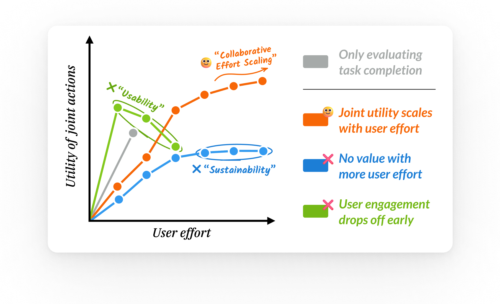

# Collaborative Effort Scaling

<p align="center">
  
</p>

---

This repository contains the code and analysis for **"Completion ≠ Collaboration: Scaling Collaborative Effort with Agents"**, a framework that captures how an agent's utility grows with increasing user involvement and reveals critical gaps in current agents' ability to sustain engagement and scaffold user understanding.

📝 **[Read the paper](https://arxiv.org/abs/2510.25744)** | 🌐 **[Visit the project page](https://www.szj.io/posts/collaborative-effort-scaling)**

## Overview

Current evaluations of agents remain centered around one-shot task completion, failing to account for the inherently iterative and collaborative nature of many real-world problems where human goals are often underspecified and evolve. We introduce **collaborative effort scaling**, a framework that captures how an agent's utility grows with increasing user involvement.

## About Collaborative Gym

This work builds on [Collaborative Gym (Co-Gym)](README-cogym.md), a framework for enabling and evaluating human-agent collaboration in shared workspaces. Co-Gym provides the infrastructure for both agents and humans to exchange messages and take actions collaboratively on tasks like travel planning, literature surveys, and tabular analysis.

**For details on the Co-Gym framework, environment setup, and agent development, please see [README-cogym.md](README-cogym.md).**

## Setup

```bash
# Create conda environment
conda create -n cogym python=3.11
conda activate cogym

# Install dependencies
pip install -r requirements.txt

# Set up API keys
cp secrets.example.toml secrets.toml
# Edit secrets.toml with your API keys

# (Optional) Build Docker image for Jupyter execution
cd docker
docker build -f Dockerfile_cpu -t cogym-jupyter-cpu-image .

# (for MAC users) You may want to run this 
export DOCKER_HOST=unix:///Users/$USER/.docker/run/docker.sock
```

## Running Experiments

```bash 
# Running the simulation 
bash scripts/travel_planning_claude40.sh

# Running progress evaluation 
python -m collaborative_gym.eval.progress_eval_v2 --result-dir workdir/travel_planning/travel_planning_basic_coagent_claude40/results --task travel_planning
python -m collaborative_gym.eval.progress_eval_v2 --result-dir workdir/travel_planning/travel_planning_coagent_with_situational_planning_claude40/results --task travel_planning

# Obtain simulated user rating over the collaboration process 
python -m collaborative_gym.eval.likert_score --result-dir workdir/travel_planning/travel_planning_basic_coagent_claude40/results --task travel_planning
python -m collaborative_gym.eval.likert_score --result-dir workdir/travel_planning/travel_planning_coagent_with_situational_planning_claude40/results --task travel_planning

# Then you may want to move the files to the final_results folder
mkdir -p final_results  
mv workdir/travel_planning/travel_planning_basic_coagent_claude40 final_results/travel_planning_one_stage_co_agent_claude40
mv workdir/travel_planning/travel_planning_coagent_with_situational_planning_claude40 final_results/travel_planning_two_stage_co_agent_claude40
```

## Analysis 

Please refer to [`paper-analysis.ipynb`](paper-analysis.ipynb) for the analysis and plotting code.

## Citation

If you use this work, please cite both the collaborative effort scaling paper and the Collaborative Gym framework:

```bibtex
@article{shen2025designing,
  title={Completion $\neq$ Collaboration: Scaling Collaborative Effort with Agents},
  author={Shen, Shannon Zejiang and Chen, Valerie and Gu, Ken and Ross, Alexis and Ma, Zixian and Gu, Alex and Si, Chenglei and Ross, Jillian and Shen, Jocelyn J and Chi, Wayne and Peng, Andi and Talwalkar, Ameet and Wu, Tongshuang and Sontag, David},
  journal={arXiv preprint arXiv:2510.25744},
  year={2025}
}

@misc{shao2025collaborativegym,
  title={Collaborative Gym: A Framework for Enabling and Evaluating Human-Agent Collaboration}, 
  author={Yijia Shao and Vinay Samuel and Yucheng Jiang and John Yang and Diyi Yang},
  year={2025},
  eprint={2412.15701},
  archivePrefix={arXiv},
  primaryClass={cs.AI},
  url={https://arxiv.org/abs/2412.15701}, 
}
```
